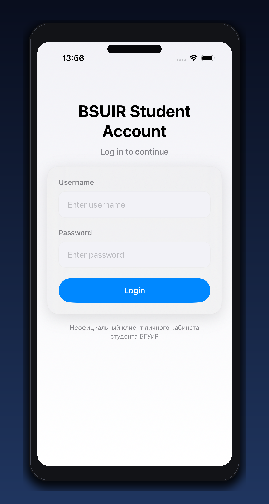
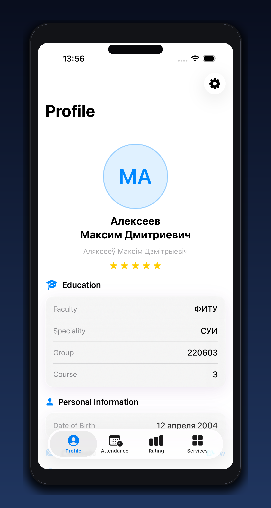
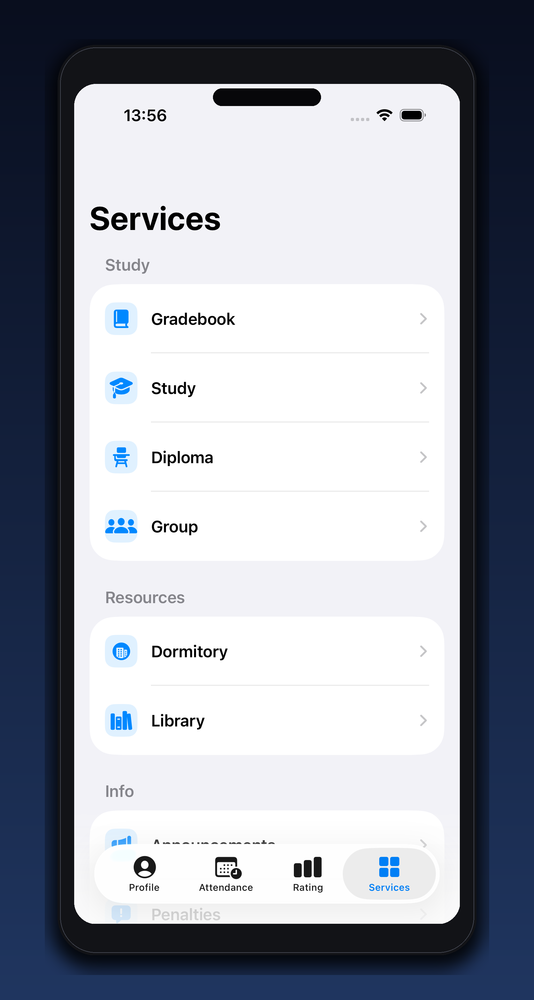
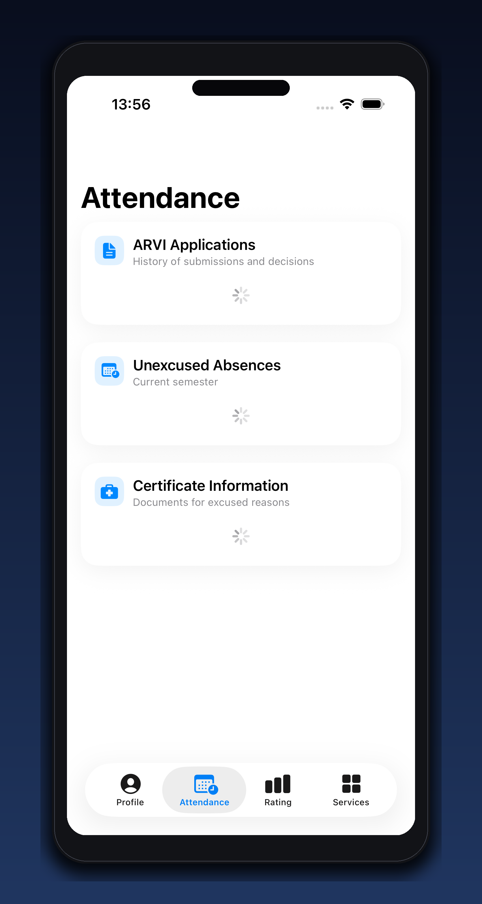
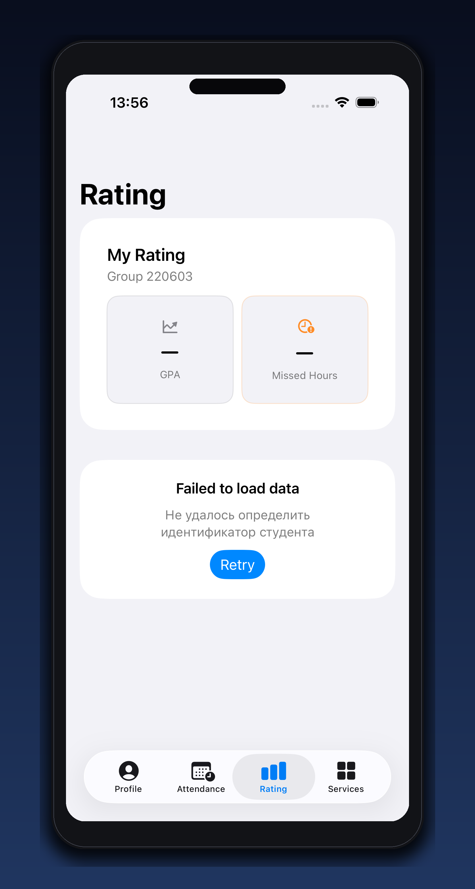
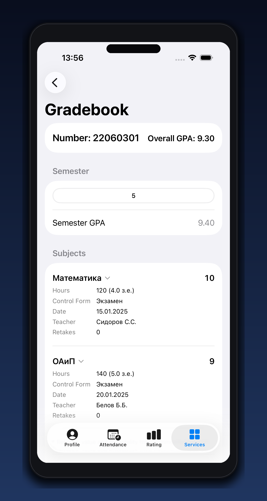

# MyIIS


MyIIS - iOS-приложение для студентов БГУИР. Оно объединяет профиль студента, расписание, посещаемость, оценки, рейтинг, СЭО, общежитие, библиотеку, объявления и студенческие сервисы в одном SwiftUI-интерфейсе.

## Скриншоты

| Вход | Профиль | Сервисы |
| --- | --- | --- |
|  |  |  |

| Посещаемость | Рейтинг | Зачетка |
| --- | --- | --- |
|  |  |  |

## Возможности

- Авторизация через IIS БГУИР и безопасное хранение учетных данных в Keychain.
- Профиль студента, учебная группа и основные персональные данные.
- Расписание, журнал посещаемости, рейтинг и электронная зачетка.
- СЭО/LMS: вход, курсы, тесты и вспомогательные экраны.
- Студенческие сервисы: заявления, справки, общежитие, библиотека, активности и объявления.
- Виджет посещаемости и App Intents для системной интеграции iOS.
- Локализация на русском, английском, белорусском и украинском языках.
- GitHub Actions для SideStore-ленты и App Store Connect release pipeline.

## Стек

- Swift 6
- SwiftUI
- Swift Concurrency
- MVVM
- URLSession
- WidgetKit
- App Intents
- XCTest / XCUITest
- fastlane
- GitHub Actions

## Требования

- macOS с Xcode 26 или новее.
- iOS Simulator с устройством `iPhone 17 Pro` для команд из примеров.
- Доступ к аккаунту IIS БГУИР для интеграционных проверок.
- Ruby и fastlane, если нужно генерировать App Store screenshots.

## Быстрый старт

Склонируйте репозиторий и откройте проект:

```bash
git clone https://github.com/ordinad/MyIIS.git
cd MyIIS
open MyIIS.xcodeproj
```

Сборка из терминала:

```bash
xcodebuild build \
  -project MyIIS.xcodeproj \
  -scheme MyIIS \
  -destination 'platform=iOS Simulator,name=iPhone 17 Pro'
```

Запуск unit-тестов:

```bash
xcodebuild test \
  -project MyIIS.xcodeproj \
  -scheme MyIIS \
  -destination 'platform=iOS Simulator,name=iPhone 17 Pro'
```

## Локальная конфигурация

Реальные учетные данные не должны попадать в git. Для локальных API-проверок создайте `.env` на основе примера:

```bash
cp .env.example .env
```

Заполните переменные:

```bash
IIS_USERNAME=...
IIS_PASSWORD=...
```

Перед запуском интеграционных проверок экспортируйте окружение:

```bash
set -a
source .env
set +a
```

Тесты, которым нужен реальный аккаунт, читают `IIS_USERNAME` и `IIS_PASSWORD` из окружения и пропускаются без них.

## Структура проекта

```text
MyIIS/                  Основное iOS-приложение
MyIIS/Models/           Модели API и доменные сущности
MyIIS/Services/         Сетевые клиенты, авторизация, настройки и интеграции
MyIIS/ViewModels/       Состояние экранов и бизнес-логика
MyIIS/Views/            SwiftUI-экраны и переиспользуемые представления
Shared/                 Общий код приложения, виджета и App Intents
MyIISWidget/            WidgetKit-расширение посещаемости
MyIISIntents/           App Intents extension
MyIISTests/             Unit/API decoding tests
MyIISUITests/           UI-тесты и snapshot-сценарии
API/                    Документация и заметки по IIS API
Configs/                Конфигурации таргетов и Info.plist
fastlane/               Автоматизация скриншотов
static/                 GitHub Pages: about, privacy policy, terms
public/showcase/        Скриншоты для README и публичной витрины
```

## API

Приложение работает с IIS БГУИР и использует фактические endpoint-контракты из локальной документации:

- [API/REAL_API_ENDPOINTS.md](API/REAL_API_ENDPOINTS.md) - актуальные рабочие endpoint'ы.
- [API/API_REFERENCE.swift](API/API_REFERENCE.swift) - Swift-справочник по API-контрактам.
- [SwaggerHub BsuirAdditionalApi](https://app.swaggerhub.com/apis-docs/N1ghtF1re/BsuirAdditionalApi/2.0.0) - внешняя справка, которая может отставать от реального API.

## Скриншоты для App Store

Генерация screenshots через fastlane:

```bash
fastlane ios screenshots
```

Витринные изображения для README лежат в `public/showcase/`. Fastlane-скриншоты генерируются в `fastlane/screenshots/`.

## Релизы

Релизный контур разделен на два workflow:

- `.github/workflows/deploy.yml` - SideStore feed для тегов `v*.*.*`.
- `.github/workflows/appstore-release.yml` - ручной App Store Connect pipeline через `workflow_dispatch`.

SideStore workflow собирает IPA, обновляет `apps.json`, `MyIIS.ipa` и `icon.png`, публикует GitHub Release и открывает PR с обновлением feed-артефактов. Эти файлы выглядят как build artifacts, но используются GitHub Pages и SideStore, поэтому удалять их можно только вместе с изменением release pipeline.

## Безопасность

- Не храните в git `.env`, реальные логины, пароли, cookie, provisioning profiles, сертификаты и приватные ключи.
- Для интеграционных тестов используйте переменные окружения, а не hardcode в Swift или Markdown.
- Если реальные учетные данные попадали в историю git, смените пароль в IIS.
- Перед публикацией проверьте App Privacy checklist: [.github/appstore/APP_PRIVACY_CONNECT_CHECKLIST.md](.github/appstore/APP_PRIVACY_CONNECT_CHECKLIST.md).

## Документация

- [PROJECT_DOCUMENTATION.md](PROJECT_DOCUMENTATION.md) - подробная техническая документация проекта.
- [Apple Human Interface Guidelines](https://developer.apple.com/design/human-interface-guidelines/) - дизайн-ориентиры для iOS-интерфейса.
- [Static about page](static/about/index.html)
- [Privacy policy](static/privacy-policy/index.html)
- [Terms and conditions](static/terms-and-conditions/index.html)

## Лицензия

Лицензия в репозитории не указана. Перед публичным распространением добавьте `LICENSE` и явно зафиксируйте условия использования кода.
