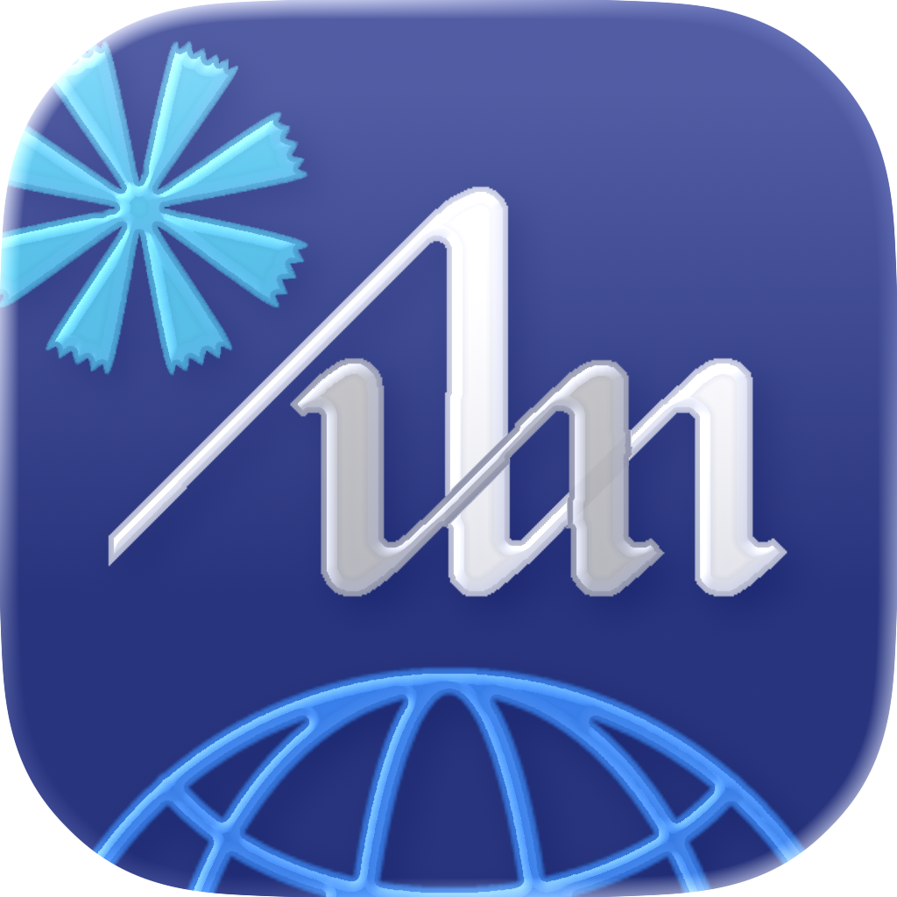
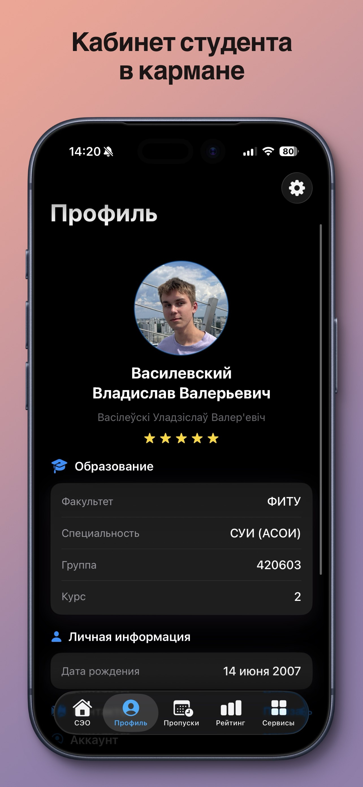
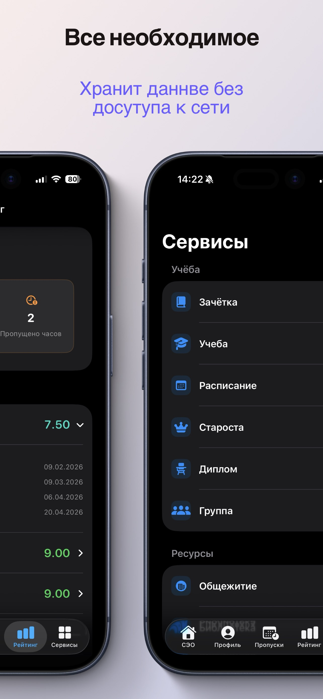
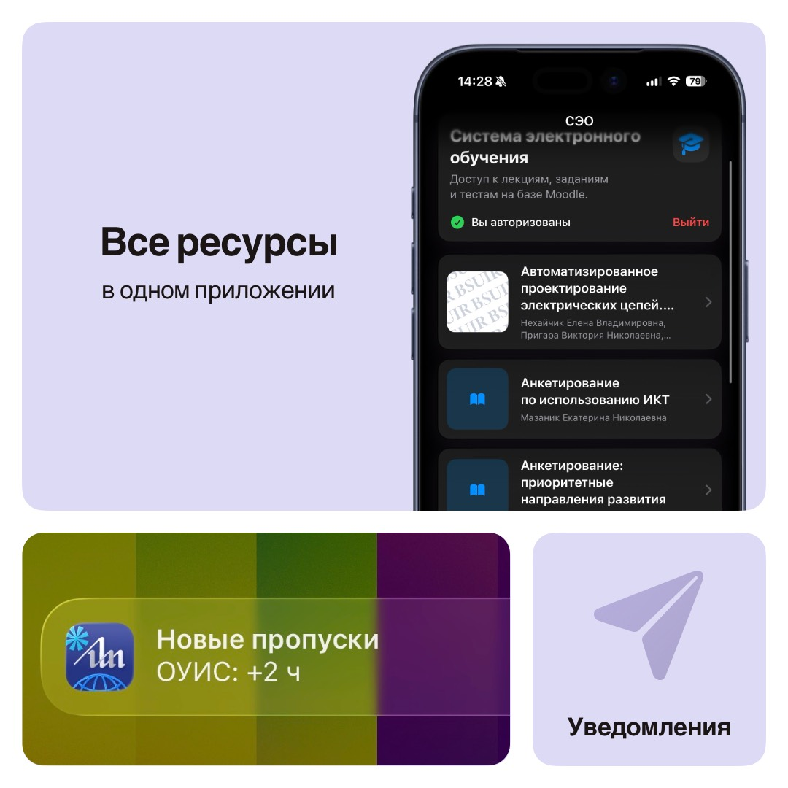
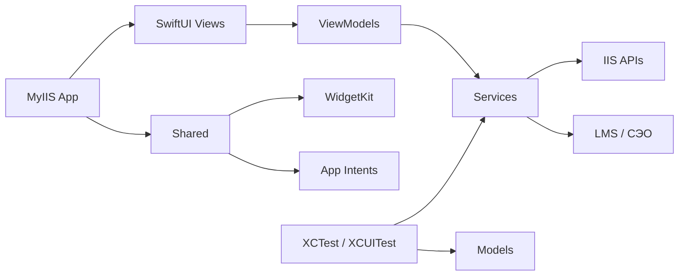

<p align="center">
  
</p>

# MyIIS

<p>
  
  
  
  
  
</p>

MyIIS - iOS-приложение для студентов БГУИР. Оно собирает личный кабинет, учебные данные, сервисы университета и СЭО в одном SwiftUI-интерфейсе без необходимости переключаться между разными веб-страницами.

## Инфографика

<p align="center">
  
  
  
</p>

## Возможности

**Личный кабинет**

- Авторизация через IIS БГУИР с хранением учетных данных в Keychain.
- Профиль студента: ФИО, фото, группа, факультет, специальность и учебный статус.
- Быстрый обзор ключевых учебных показателей без ручного обхода разделов личного кабинета.

**Учебный контур**

- Расписание занятий, экзаменов и учебных событий.
- Посещаемость с детализацией по предметам и пропускам.
- Рейтинг, текущие баллы и электронная зачетка.
- Отдельные состояния загрузки, ошибок и пустых данных для нестабильных API-ответов.

**СЭО и университетские сервисы**

- Интеграция с LMS/СЭО: курсы, тесты и вспомогательные учебные экраны.
- Заявления, справки, общежитие, библиотека, активности и объявления.
- Локализованный интерфейс для русского, английского, белорусского и украинского языков.

**iOS-интеграции**

- SwiftUI-интерфейс с адаптацией под современные iPhone.
- WidgetKit-виджет для быстрых учебных статусов.
- App Intents для системных сценариев iOS.
- XCTest и XCUITest для проверки моделей, сервисов и основных пользовательских путей.

## Стек

<div align="center">
  
  
  
  
  
  <br>
  
  
  
  
  
</div>

## Структура проекта

```text
MyIIS/                  Основное iOS-приложение
MyIIS/Models/           Модели API и доменные сущности
MyIIS/Services/         Сетевые клиенты, авторизация, настройки и интеграции
MyIIS/ViewModels/       Состояние экранов и бизнес-логика
MyIIS/Views/            SwiftUI-экраны и переиспользуемые представления
Shared/                 Общий код приложения, виджета и App Intents
MyIISWidget/            WidgetKit-расширение
MyIISIntents/           App Intents extension
MyIISTests/             Unit/API decoding tests
MyIISUITests/           UI-тесты и snapshot-сценарии
API/                    Документация и заметки по IIS API
Configs/                Конфигурации таргетов и Info.plist
fastlane/               Автоматизация App Store screenshots
static/                 GitHub Pages: about, privacy policy, terms
public/showcase/        Скриншоты для README и публичной витрины
```



## API

Приложение работает с IIS БГУИР и ориентируется на фактические endpoint-контракты:

- [API/REAL_API_ENDPOINTS.md](API/REAL_API_ENDPOINTS.md) - актуальные рабочие endpoint'ы.
- [API/API_REFERENCE.swift](API/API_REFERENCE.swift) - Swift-справочник по API-контрактам.
- [SwaggerHub BsuirAdditionalApi](https://app.swaggerhub.com/apis-docs/N1ghtF1re/BsuirAdditionalApi/2.0.0) - внешняя справка, которая может отставать от реального API.

## Лицензия

Проект распространяется по [PolyForm Noncommercial License 1.0.0](LICENSE).

Код можно изучать, запускать, изменять и использовать для некоммерческих целей. Коммерческое использование, коммерческие производные проекты и включение кода в коммерческие продукты требуют отдельного письменного разрешения правообладателя.
